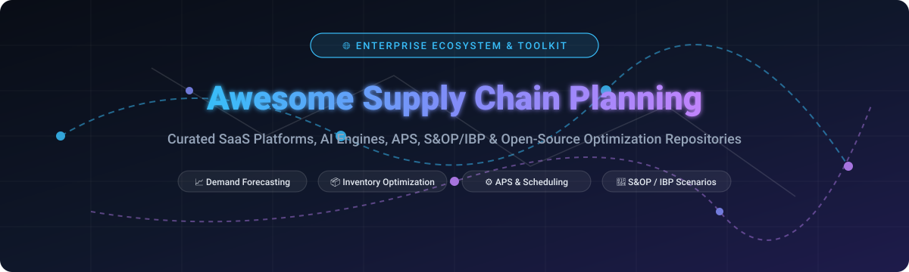

  

<h1 align="center">Awesome Supply Chain Planning 🚀📦</h1>

  <strong>Curated ecosystem of top SaaS platforms, AI engines, APS, S&OP/IBP & open-source optimization repositories for modern supply chain planning.</strong>

  
  
  
  
  
  

---

## 📖 Overview & Ecosystem Guide

Welcome to the **Awesome Supply Chain Planning** knowledge hub! This repository is an authoritative directory tracking industry-leading **SaaS platforms**, **enterprise planning engines**, and battle-tested **open-source repositories** designed for end-to-end supply chain orchestration.

Whether you are implementing enterprise **Sales & Operations Planning (S&OP)**, **Integrated Business Planning (IBP)**, **Advanced Planning & Scheduling (APS)**, **Multi-Echelon Inventory Optimization (MEIO)**, or machine-learning-based **Demand Forecasting & Sensing**, this curated list helps you compare capabilities, market scale, and pricing transparently.

> 📅 **Last updated:** August 2026

---

## 📑 Table of Contents

- [🏢 SaaS & Hosted Platforms](#-saas--hosted-platforms)
- [🛠️ Open-Source GitHub Projects](#️-open-source-github-projects)
- [🏗️ Architectural Blueprint for Custom Planning Systems](#️-architectural-blueprint-for-custom-planning-systems)
- [🤝 How to Contribute](#-how-to-contribute)
- [📈 Star History](#-star-history)
- [⚖️ Disclaimer](#️-disclaimer)

---

## 🏢 SaaS & Hosted Platforms

*Enterprise and mid-market supply chain planning SaaS suites, sorted by company valuation / revenue scale (descending).*

| 🏷️ Platform | 💰 Valuation / Revenue Scale | 📝 Description | 💵 Pricing (Starting Tier) | 🎁 Free Tier / Trial Limits |
| :--- | :--- | :--- | :--- | :--- |
| **[Anaplan](https://www.anaplan.com/)** | **~$10.7B Valuation** (Acquired by Thoma Bravo; ~$1.0B+ ARR) | Connected planning platform widely used for S&OP, demand planning, and financial-supply chain integration through flexible hyperblock modeling. | Starts at ~$30,000 – $50,000 / year (Approx. $156–$312/user/yr for Viewers, $1,950/user/yr for Contributors, $9,750/user/yr for Model Builders) | No free tier (0-day free trial; 90-day guided Proof-of-Concept / custom prototype sandbox for enterprise evaluations) |
| **[Blue Yonder](https://blueyonder.com/)** | **~$8.5B Valuation** (Panasonic subsidiary; ~$1.42B Revenue) | Comprehensive supply chain planning and execution suite with particular strength in CPG, retail, and demand sensing, often paired with warehouse & fulfillment capabilities. | Starts at ~$100,000 / year (or ~$5,000 – $15,000 / month for mid-market single-module deployments) | No free tier (0-day free trial; guided vendor demo and sandboxed evaluation environment on request) |
| **[RELEX Solutions](https://www.relexsolutions.com/)** | **~$5.7B Valuation** (€5.0B; ~$467M Revenue) | AI-native retail and CPG-oriented planning platform strong in demand forecasting, automated replenishment, space planning, and promotion-aware planning. | Starts at ~$50,000 – $100,000 / year (Subscription tier scaled by store count, SKU volumes, and distribution centers) | No free tier (0-day free trial; custom pilot evaluation and live scenario simulation demo on request) |
| **[o9 Solutions](https://o9solutions.com/)** | **~$3.7B Valuation** (Series C; ~$300M+ ARR) | AI- and knowledge-graph-powered Digital Brain planning platform supporting supply chain, demand sensing, and integrated business planning for large global enterprises. | Starts at ~$100,000 – $250,000 / year (Tiered enterprise licensing based on planning scope & data scale) | No free tier (0-day free trial; custom Proof-of-Concept / interactive demo environment on request) |
| **[Kinaxis](https://www.kinaxis.com/)** | **~$3.49B Market Cap** (TSX: KXS; ~$603M Revenue) | Concurrent planning platform (Maestro / RapidResponse) enabling real-time what-if scenario analysis and synchronized planning across demand, supply, and multi-site operations. | Starts at ~$250,000 / year (Enterprise deployment based on nodes/modules; annual contract) | No free tier (0-day free trial; offers free corporate Business Performance Assessment & live demo on request) |
| **[OMP](https://www.omp.com/)** | **~$240M+ Revenue** (~€220M Turnover) | Advanced planning and scheduling (APS) solutions focused on detailed production optimization, line balancing, and supply chain synchronization for process & discrete industries. | Starts at ~$100,000 / year (Enterprise subscription for Unison Planning suite) | No free tier (0-day free trial; vendor-guided Proof of Concept (POC) and custom demo on request) |
| **[Logility](https://www.logility.com/)** | **~$105M Revenue** (American Software NASDAQ: AMSWA; ~$400M Valuation) | AI-driven supply chain planning platform serving mid-market and enterprise manufacturers and distributors with demand forecasting, supply planning, and inventory optimization. | Starts at ~$50,000 – $100,000 / year (Modular subscription based on inventory nodes and user seats) | No free tier (0-day free trial; interactive live walkthrough and guided scenario demo on request) |
| **[ToolsGroup](https://www.toolsgroup.com/)** | **~$62M Revenue** (Backed by Accel-KKR) | Specialist in probabilistic demand forecasting, inventory optimization (MEIO), and service-level-driven planning for complex multi-echelon networks. | Starts at ~$5,000 / month (~$60,000 / year for base 10-user deployment; modular "Pay as you Grow" option) | No free tier (0-day free trial; guided Proof-of-Value demo and historical data assessment on request) |
| **[Arkieva](https://arkieva.com/)** | **~$47M Revenue** (Backed by Banneker Partners) | Supply chain planning software suite focused on demand, supply, finite capacity scheduling, and inventory planning with multi-scenario optimization features. | Starts at ~$30,000 – $50,000 / year (SaaS subscription based on planning modules and connected ERP feeds) | No free tier (0-day free trial; live custom scenario modeling demo and readiness consultation on request) |
| **[FuturMaster](https://www.futurmaster.com/)** | **~$24M Revenue** (Acquired by Sagard) | Demand and supply planning solutions with capabilities spanning machine learning forecasting, trade promotion management, and S&OP processes. | Starts at ~$30,000 – $50,000 / year (Bloom platform subscription based on module selection and user seats) | No free tier (0-day free trial; live guided interactive demonstration and workflow evaluation on request) |
| **[Netstock](https://www.netstock.com/)** | **~$18M Revenue** (Backed by Strattam Capital) | Cloud inventory planning and S&OP suite integrating with ERPs to optimize replenishment orders, safety stock calculations, and supplier lead-time management. | Starts at ~$900 / month (Packaged based on inventory valuation & SKU volume) | No free tier (0-day free trial; provides custom guided ROI data modeling and live platform demo upon request) |
| **[GMDH Streamline](https://streamlineplan.com/)** | **~$10M ARR** (Bootstrapped / Growth) | AI-powered demand forecasting, inventory planning, and material requirements planning (MRP) platform with multi-channel ERP & e-commerce connectors. | Starts at ~$900 / month (Annual commitment) | Free Edition limited to 50 SKUs & 1 location; 30-day free trial with full feature access |
| **[StockTrim](https://www.stocktrim.com/)** | **~$2M ARR** (Early Stage Venture) | Cloud-based inventory forecasting and automated purchase order planning software designed for growing e-commerce, manufacturing, and distribution businesses. | Starts at $99 / month (Up to 500 SKUs, 2 user seats) | 14-day free trial (no credit card required; full access to demand forecasting & MRP modules) |
| **[Inventoro](https://inventoro.com/)** | **~$1M ARR** (Early Stage Venture) | AI-driven sales forecasting, automated replenishment, and product segmentation (ABC/XYZ) platform tailored for small-to-midsize retailers and wholesalers. | Starts at $49 / user / month (Standard tier) | 14-day free trial (full feature access including ERP & e-commerce integrations) |

---

## 🛠️ Open-Source GitHub Projects

*Leading open-source software, optimization engines, constraint solvers, and forecasting toolkits for supply chain engineering, sorted by GitHub star count (descending).*

| 📦 Repository | 🌟 Stars_Badge | 🏷️ Domain / Category | 📝 Description |
| :--- | :--- | :--- | :--- |
| **[Odoo](https://github.com/odoo/odoo)** |  | ERP, MRP & Production | Full-suite open-source business management and MRP system with production scheduling, multi-warehouse inventory tracking, procurement automation, and BOM management. |
| **[ERPNext](https://github.com/frappe/erpnext)** |  | ERP, MRP & Supply Planning | Modern 100% open-source ERP system featuring MRP, production scheduling, multi-level BOMs, capacity planning, and automated inventory replenishment. |
| **[Prophet](https://github.com/facebook/prophet)** |  | Demand Forecasting | Robust time-series forecasting library designed by Facebook for handling non-linear trends, multiple seasonalities, holiday effects, and historical demand shifts. |
| **[Google OR-Tools](https://github.com/google/or-tools)** |  | Operations Research & APS | High-performance suite for combinatorial optimization, vehicle routing (VRP), job-shop scheduling, bin packing, linear programming (LP), and mixed-integer programming (MIP). |
| **[Statsmodels](https://github.com/statsmodels/statsmodels)** |  | Statistical Forecasting | Python module providing econometric time-series models (ARIMA, SARIMAX, VAR, State Space) widely utilized for classical baseline demand forecasting. |
| **[Darts](https://github.com/unit8co/darts)** |  | Time Series & Deep Forecasting | User-friendly Python library for time-series forecasting and anomaly detection, bridging classical statistical models (AutoARIMA, Exponential Smoothing) with deep architectures (TFT, N-BEATS, TiDE). |
| **[sktime](https://github.com/sktime/sktime)** |  | Machine Learning Forecasting | Unified scikit-learn compatible framework for machine learning with time series, supporting multivariate reduction, temporal transformers, and hierarchical forecasting. |
| **[CVXPY](https://github.com/cvxpy/cvxpy)** |  | Mathematical Optimization | Python-embedded domain-specific language for convex optimization problems, frequently applied to inventory safety stock optimization and supply allocation. |
| **[StatsForecast](https://github.com/Nixtla/statsforecast)** |  | High-Speed Demand Forecasting | Lightning-fast statistical time series forecasting library (AutoARIMA, ETS, CES, Multiple Seasonalities) built with Numba for large-scale SKU demand pipelines. |
| **[NeuralForecast](https://github.com/Nixtla/neuralforecast)** |  | Deep Learning Forecasting | State-of-the-art neural forecasting architectures (NHITS, PatchTST, Informer, TimesNet) optimized for complex multi-horizon demand sensing and hierarchical reconciliation. |
| **[Pyomo](https://github.com/Pyomo/pyomo)** |  | Mathematical Modeling | Comprehensive Python-based mathematical modeling package for formulating linear, mixed-integer, and nonlinear supply chain network design and plant scheduling models. |
| **[PuLP](https://github.com/coin-or/pulp)** |  | Linear & Integer Programming | High-level LP/MILP modeler in Python that integrates with solvers like CBC, GLPK, and CPLEX to solve supply distribution, plant allocation, and transportation problems. |
| **[Timefold Solver](https://github.com/TimefoldAI/timefold-solver)** |  | AI Constraint Solver & APS | AI-driven constraint optimization engine (formerly OptaPlanner) for complex planning and scheduling: vehicle routing problems (VRP), employee shifts, and factory production lines. |
| **[MLForecast](https://github.com/Nixtla/mlforecast)** |  | Scalable ML Forecasting | High-performance machine learning time-series framework using LightGBM, XGBoost, and CatBoost with automated lag generation for retail demand sensing. |
| **[frePPLe](https://github.com/frePPLe/frepple)** |  | APS & Demand Planning | Leading open-source Advanced Planning & Scheduling (APS) and demand forecasting application for manufacturing. Supports constraint-based planning, multi-level BOMs, capacity limits, and REST APIs. |
| **[Open mSupply](https://github.com/msupply-foundation/open-msupply)** |  | Public Health Supply Chain | Open-source supply chain and inventory management system designed for public health distribution networks, remote facilities, and low-connectivity environments. |
| **[planr](https://github.com/viniciust/planr)** |  | DRP & Inventory Analytics | R package for supply chain and operations planning providing functions for projected inventory calculations, stock coverage analysis, and Distribution Requirements Planning (DRP). |

---

## 🏗️ Architectural Blueprint for Custom Planning Systems

To build a cost-effective, transparent, and modular internal planning stack:

1. 📥 **Core APS & Planning Foundation**: Use **[frePPLe](https://github.com/frePPLe/frepple)** or **[ERPNext](https://github.com/frappe/erpnext)** / **[Odoo](https://github.com/odoo/odoo)** as your operational transactional backbone and constraint-based scheduling core.
2. 🔮 **Demand Sensing & Forecasting Layer**: Feed transaction histories into **[StatsForecast](https://github.com/Nixtla/statsforecast)**, **[Darts](https://github.com/unit8co/darts)**, or **[Prophet](https://github.com/facebook/prophet)** to compute automated SKU-level statistical baselines and promotional uplifts.
3. ⚡ **Combinatorial Optimization Engine**: Utilize **[Google OR-Tools](https://github.com/google/or-tools)**, **[Timefold Solver](https://github.com/TimefoldAI/timefold-solver)**, or **[PuLP](https://github.com/coin-or/pulp)** to solve NP-hard job-shop scheduling, machine changeover minimization, and vehicle routing.
4. 📊 **Workflow Orchestration & Visualization**: Orchestrate daily/weekly data ingestion jobs using Apache Airflow or Prefect, and surface interactive S&OP dashboards via Apache Superset or Metabase.

---

## 🤝 How to Contribute

Contributions are warmly welcomed! Help keep this guide comprehensive, accurate, and up to date:

1. 🍴 **Fork the repository**.
2. 🌿 **Create a new branch**: `git checkout -b feature/add-new-tool`
3. ✍️ **Add or edit entries in `README.md`** following the existing tabular or badge format:
   - Provide platform name, official link, factual summary, specific pricing tier, and free trial / star badge details.
4. 🚀 **Submit a Pull Request** with a concise description of your changes.

⭐ **Star the repo** if you find this resource helpful for your supply chain and operations planning journey!

---

## 📈 Star History

---

## ⚖️ Disclaimer

- This is a **community-curated** list intended for informational and educational purposes — not an endorsement of any vendor or platform.
- Supply chain planning software directly impacts inventory investments, manufacturing throughput, and customer service delivery. Always validate model outputs and optimization algorithms against physical operational constraints before execution.
- Planning precision is fundamentally dependent on master data hygiene, lead time accuracy, and cross-functional S&OP organizational maturity.

---

  <strong>Made with ❤️ for supply chain planners, S&OP managers, operations researchers, and software engineers worldwide.</strong> 
  <em>Let's make supply chain planning more accessible, transparent, and resilient.</em>

